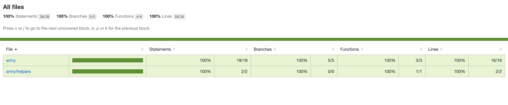

# Game Algorithm - Serverless based

## Problem Statement

This algorithm solves the problem where a player has to attack an enemy, and have to create an army for an attack.
Army may consist of Spearmen, Swordsmen, and Archers.

___

## Installation

First it is required to install Serverless framework locally by this command.

```bash
npm install -g serverless
```

After installing serverless framework, install package dependencies:

```bash
npm install
```

___

## Local Development

We will be using SLS Offline Plugin to simulate the AWS Lambda and API Gateway behavior and to run an API locally. In order to do that, execute the following command:

```bash
serverless offline
```

And invoke an API through this endpoint (Where 100 in the URL is the number of soldiers needed):

```bash
  http://localhost:3000/army/100
```

Which should result in response similar to the following:

```json
{
    "success": true,
    "data": [
        {
            "type": "spearmen",
            "count": 53
        },
        {
            "type": "swordsmen",
            "count": 10
        },
        {
            "type": "archer",
            "count": 37
        }
    ],
    "message": "Army is ready to attack 🗡"
}
```

___

## Project Structure

* `__tests__` - contains unit tests.
* `army` - contains the logic of the algorithm to create an army.
  * `interfaces` - contains the interface of the algorithm.
  * `helpers` - contains the helpers of the algorithm.
  * `create.ts` - contains the main handler to invoke an API and handles the logic of the algorithm.
* `events` - contains the events to be used by the serverless framework to mock an API Gateway to request payload.
* `serverless.yml` - contains the configuration of the serverless framework.
* `package.json` - contains the project metadata and dependencies to be installed.

## Testing

Jest is configured in order to handle the Unit Tests of our algorithm.

Run this command in order to run the unit tests:

```bash
npm run test
```

___

## Code Coverage

All functions and business logics of a code has been covered by unit tests.

